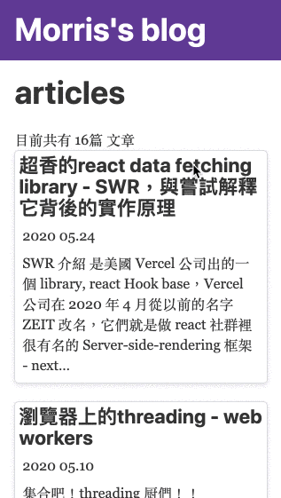

# useGetNowScrollDirection

## a react customHook to know now user is scrollUp or scrollDown on the Screen

## install
```
npm install use-get-now-scroll-direction

 or

yarn add use-get-now-scroll-direction
```

## has two hooks now
1. useGetIsScrollOverThreshold

``` javascript
import { useGetIsScrollOverThreshold } from 'use-get-now-scroll-direction'

export default function YourComponent(){
  const isScrollOverThreshold = useGetIsScrollOverThreshold(200) // how much scroll down distance you want to detect(the whole page, if exceeed, return true, otherwise return false)

  ...return the UI descriptions depend on the change of  `isScrollOverThreshold` 
}
```

- perhaps usage scenario: 
a fixed header when user scroll down


2. useGetNowScrollDirection

``` javascript
import { useGetNowScrollDirection } from 'use-get-now-scroll-direction'

export default function YourComponent(){
  const isScrollDown = useGetNowScrollDirection(200) // detect is user scrolling down, if it is, return true, otherwise return false

  ...return the UI descriptions depend on the change of  `isScrollDown` 
}
```

- perhaps usage scenario: 
hide header and footer when user scrolling down, show them when scrolling up

